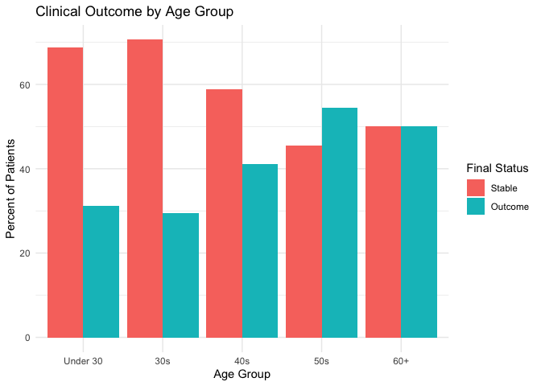
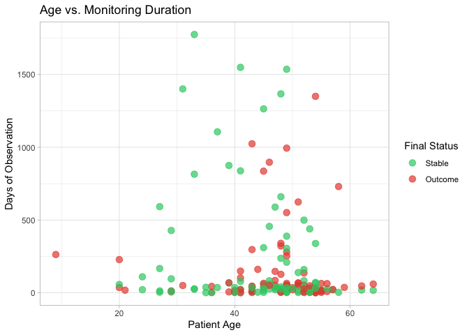
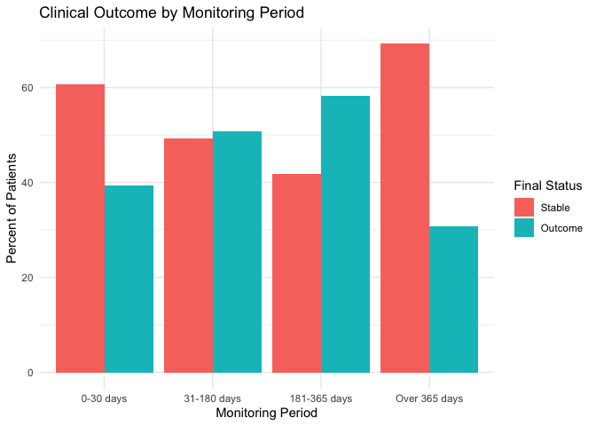
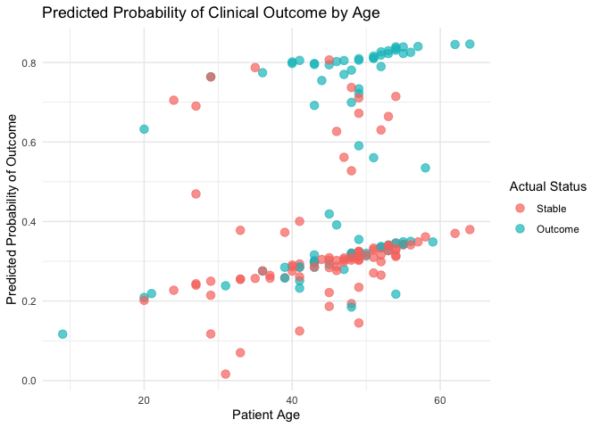

Patient Outcome Analysis: Heart Transplant Wait-List Data
================

## Executive Summary

This project analyzes the full heart transplant wait-list data set (172
patients) from the R `survival` package. We explore clinical indicators
such as age, transplant status, and monitoring duration to understand
patient outcomes. The goal is to demonstrate a basic Healthcare IT
analytics workflow using R.

------------------------------------------------------------------------

## Tools Used

- R
- tidyverse
- ggplot2
- survival package
- Logistic regression

------------------------------------------------------------------------

## Dataset Description

The dataset comes from the R `survival` package which contains survival
data for patients on the waiting list for the Stanford heart transplant
program.

For this project, we focused on these variables:

- `Age`: patient age in years
- `Status`: final clinical status, labeled as `Stable` or `Outcome`
- `Monitoring_Days`: number of days observed in the dataset
- `Transplant`: whether the patient received a transplant

------------------------------------------------------------------------

## Data Loading and Cleaning

``` r
# load libraries 
library(tidyverse)
library(ggplot2)

# contains professional "Heart" data set
data(heart, package = "survival")

# data cleaning
heart_clean <- heart %>%
  mutate(Age = round(age + 48), # correcting to actual age
    Status = factor(event, levels = c(0, 1), labels = c("Stable", "Outcome")), # labeling clinical outcomes
    Monitoring_Days = as.integer(stop - start),  # calculating total observation period
    Transplant = factor(transplant, levels = c(0, 1), labels = c("No", "Yes"))) %>% # labeling transplant status
  select(Age, Status, Monitoring_Days, Transplant)
heart_clean
```

    ##     Age  Status Monitoring_Days Transplant
    ## 1    31 Outcome              50         No
    ## 2    52 Outcome               6         No
    ## 3    54  Stable               1         No
    ## 4    54 Outcome              15        Yes
    ## 5    40  Stable              36         No
    ## 6    40 Outcome               3        Yes
    ## 7    21 Outcome              18         No
    ## 8    55 Outcome               3         No
    ## 9    51  Stable              51         No
    ## 10   51 Outcome             624        Yes
    ## 11   45 Outcome              40         No
    ## 12   47 Outcome              85         No
    ## 13   43  Stable              12         No
    ## 14   43 Outcome              46        Yes
    ## 15   48  Stable              26         No
    ## 16   48 Outcome             127        Yes
    ## 17   53 Outcome               8         No
    ## 18   55  Stable              17         No
    ## 19   55 Outcome              64        Yes
    ## 20   54  Stable              37         No
    ## 21   54 Outcome            1350        Yes
    ## 22   54 Outcome               1         No
    ## 23   49  Stable              28         No
    ## 24   49 Outcome             280        Yes
    ## 25   20 Outcome              36         No
    ## 26   57  Stable              20         No
    ## 27   57 Outcome              23        Yes
    ## 28   59 Outcome              37         No
    ## 29   55  Stable              18         No
    ## 30   55 Outcome              10        Yes
    ## 31   43  Stable               8         No
    ## 32   43 Outcome            1024        Yes
    ## 33   43  Stable              12         No
    ## 34   43 Outcome              39        Yes
    ## 35   58  Stable               3         No
    ## 36   58 Outcome             730        Yes
    ## 37   52  Stable              83         No
    ## 38   52 Outcome             136        Yes
    ## 39   33  Stable              25         No
    ## 40   33  Stable            1775        Yes
    ## 41   31  Stable            1401         No
    ## 42    9 Outcome             263         No
    ## 43   54  Stable              71         No
    ## 44   54 Outcome               1        Yes
    ## 45   50 Outcome              35         No
    ## 46   45  Stable              16         No
    ## 47   45 Outcome             836        Yes
    ## 48   55 Outcome              16         No
    ## 49   64  Stable              17         No
    ## 50   64 Outcome              60        Yes
    ## 51   49  Stable              51         No
    ## 52   49  Stable            1536        Yes
    ## 53   41  Stable              23         No
    ## 54   41  Stable            1549        Yes
    ## 55   43 Outcome              12         No
    ## 56   49  Stable              46         No
    ## 57   49 Outcome              54        Yes
    ## 58   62  Stable              19         No
    ## 59   62 Outcome              47        Yes
    ## 60   41  Stable               4         No
    ## 61   41 Outcome               0        Yes
    ## 62   51  Stable               2         No
    ## 63   51 Outcome              51        Yes
    ## 64   48  Stable              41         No
    ## 65   48  Stable            1367        Yes
    ## 66   45  Stable              58         No
    ## 67   45  Stable            1264        Yes
    ## 68   36 Outcome               3         No
    ## 69   43 Outcome               2         No
    ## 70   43 Outcome              40         No
    ## 71   36  Stable               1         No
    ## 72   36 Outcome              44        Yes
    ## 73   49  Stable               2         No
    ## 74   49 Outcome             994        Yes
    ## 75   47  Stable              21         No
    ## 76   47 Outcome              51        Yes
    ## 77   56 Outcome               9         No
    ## 78   37  Stable              36         No
    ## 79   37  Stable            1106        Yes
    ## 80   46  Stable              83         No
    ## 81   46 Outcome             897        Yes
    ## 82   49  Stable              32         No
    ## 83   49 Outcome             253        Yes
    ## 84   41 Outcome             102         No
    ## 85   47  Stable              41         No
    ## 86   47 Outcome             147        Yes
    ## 87   48 Outcome               3         No
    ## 88   52  Stable              10         No
    ## 89   52 Outcome              51        Yes
    ## 90   39  Stable              67         No
    ## 91   39  Stable             875        Yes
    ## 92   41 Outcome             149         No
    ## 93   48  Stable              21         No
    ## 94   48 Outcome             322        Yes
    ## 95   41  Stable              78         No
    ## 96   41  Stable             838        Yes
    ## 97   49  Stable               3         No
    ## 98   49 Outcome              65        Yes
    ## 99   53 Outcome               2         No
    ## 100  39 Outcome              69         No
    ## 101  33  Stable              27         No
    ## 102  33  Stable             815        Yes
    ## 103  49  Stable              33         No
    ## 104  49 Outcome             551        Yes
    ## 105  51  Stable              12         No
    ## 106  51 Outcome              66        Yes
    ## 107  53 Outcome              32         No
    ## 108  20  Stable              57         No
    ## 109  20 Outcome             228        Yes
    ## 110  45  Stable               3         No
    ## 111  45 Outcome              65        Yes
    ## 112  48  Stable              10         No
    ## 113  48  Stable             660        Yes
    ## 114  53  Stable               5         No
    ## 115  53 Outcome              25        Yes
    ## 116  47  Stable              31         No
    ## 117  47  Stable             589        Yes
    ## 118  27  Stable               4         No
    ## 119  27  Stable             592        Yes
    ## 120  56  Stable              27         No
    ## 121  56 Outcome              63        Yes
    ## 122  29  Stable               5         No
    ## 123  29 Outcome              12        Yes
    ## 124  52 Outcome               2         No
    ## 125  52  Stable              46         No
    ## 126  52  Stable             499        Yes
    ## 127  41 Outcome              21         No
    ## 128  49  Stable             210         No
    ## 129  49  Stable             305        Yes
    ## 130  54  Stable              67         No
    ## 131  54 Outcome              29        Yes
    ## 132  46  Stable              26         No
    ## 133  46  Stable             456        Yes
    ## 134  53  Stable               6         No
    ## 135  53  Stable             439        Yes
    ## 136  29  Stable             428         No
    ## 137  53  Stable              32         No
    ## 138  53 Outcome              48        Yes
    ## 139  43  Stable              37         No
    ## 140  43 Outcome             297        Yes
    ## 141  48 Outcome               5         No
    ## 142  49  Stable               8         No
    ## 143  49  Stable             389        Yes
    ## 144  46  Stable              60         No
    ## 145  46 Outcome              50        Yes
    ## 146  54  Stable              31         No
    ## 147  54  Stable             339        Yes
    ## 148  51  Stable             139         No
    ## 149  51 Outcome              68        Yes
    ## 150  52  Stable             160         No
    ## 151  52 Outcome              26        Yes
    ## 152  48 Outcome             340         No
    ## 153  45  Stable             310         No
    ## 154  45  Stable              30        Yes
    ## 155  48  Stable              28         No
    ## 156  48  Stable             237        Yes
    ## 157  44  Stable               4         No
    ## 158  44 Outcome             161        Yes
    ## 159  40  Stable               2         No
    ## 160  40 Outcome              14        Yes
    ## 161  27  Stable              13         No
    ## 162  27  Stable             167        Yes
    ## 163  24  Stable              21         No
    ## 164  24  Stable             110        Yes
    ## 165  29  Stable              96         No
    ## 166  29  Stable              13        Yes
    ## 167  50 Outcome              21         No
    ## 168  35  Stable              38         No
    ## 169  35  Stable               1        Yes
    ## 170  50  Stable              31         No
    ## 171  40  Stable              11         No
    ## 172  39 Outcome               6         No

``` r
# verify cleaned data and count
heart_count <- nrow(heart_clean) # counting 172
heart_count
```

    ## [1] 172

The original `Age` variable is stored as age minus 48 in the processed
dataset, we added 48 back to make the age easier to understand. We also
changed the numeric outcome and transplant variables into readable
labels.

------------------------------------------------------------------------

## Summary of Patient Data

``` r
# summary table
summary_table <- heart_clean %>%
  summarize(
    Total_Patients = n(),
    Average_Age = round(mean(Age), 1),  
    Median_Age = median(Age), 
    Average_Monitoring_Days = round(mean(Monitoring_Days), 1),
    Median_Monitoring_Days = median(Monitoring_Days),
    Stable_Count = sum(Status == "Stable"),
    Outcome_Count = sum(Status == "Outcome"),
    Transplant_Count = sum(Transplant == "Yes"),
    No_Transplant_Count = sum(Transplant == "No"))
summary_table
```

    ##   Total_Patients Average_Age Median_Age Average_Monitoring_Days
    ## 1            172        45.5         48                   185.8
    ##   Median_Monitoring_Days Stable_Count Outcome_Count Transplant_Count
    ## 1                   38.5           97            75               69
    ##   No_Transplant_Count
    ## 1                 103

This summary table gives a quick overview of the patient group. It shows
the number of patients, age range, average monitoring duration, outcome
count, and transplant count.

------------------------------------------------------------------------

## Exploratory Data Analysis

### Age Distribution of Heart Patients

``` r
# creating plot 
ggplot(heart_clean, aes(x = Age)) +
  geom_histogram(binwidth = 5, fill = "#3498db", color = "white") +
  labs(title = "Patient Age Distribution", x = "Age (Years)", y = "Patient Count") +
  theme_minimal()
```

<!-- -->

The histogram shows that many patients in this dataset were middle-aged.
This helps describe the patient group, but it should not be used to make
broad medical conclusions because this dataset is small and specific to
one heart transplant program.

------------------------------------------------------------------------

### Clinical Outcome by Transplant Status

``` r
# outcome by transplant
outcome_by_transplant <- heart_clean %>%
  group_by(Transplant, Status) %>%
  summarise(Count = n(), .groups = "drop") %>%
  group_by(Transplant) %>%
  mutate(Percent = round(Count / sum(Count) * 100, 1))
outcome_by_transplant
```

    ## # A tibble: 4 × 4
    ## # Groups:   Transplant [2]
    ##   Transplant Status  Count Percent
    ##   <fct>      <fct>   <int>   <dbl>
    ## 1 No         Stable     73    70.9
    ## 2 No         Outcome    30    29.1
    ## 3 Yes        Stable     24    34.8
    ## 4 Yes        Outcome    45    65.2

``` r
# creating plot
ggplot(outcome_by_transplant, aes(x = Transplant, y = Percent, fill = Status)) +
  geom_col(position = "dodge") +
  labs(title = "Clinical Outcome by Transplant Status",
       x = "Received Transplant", y = "Percent of Patients", fill = "Final Status") +
  theme_minimal()
```

<!-- -->

This chart compares patient outcomes based on whether the patient
received a transplant. This is useful for finding patterns in the data.
However, this is observational data, so the result shows association
only. It does not prove that transplant status directly caused the
outcome.

------------------------------------------------------------------------

### Clinical Outcome by Age Group

``` r
# grouping age
heart_clean <- heart_clean %>%
  mutate(
    Age_Group = case_when(
      Age < 30 ~ "Under 30",
      Age >= 30 & Age < 40 ~ "30s",
      Age >= 40 & Age < 50 ~ "40s",
      Age >= 50 & Age < 60 ~ "50s",
      Age >= 60 ~ "60+"),
    Age_Group = factor(
      Age_Group,
      levels = c("Under 30", "30s", "40s", "50s", "60+")))

# outcome clean
age_outcome <- heart_clean %>%
  group_by(Age_Group, Status) %>%
  summarise(Count = n(), .groups = "drop") %>%
  group_by(Age_Group) %>%
  mutate(Percent = round(Count / sum(Count) * 100, 1))
age_outcome
```

    ## # A tibble: 10 × 4
    ## # Groups:   Age_Group [5]
    ##    Age_Group Status  Count Percent
    ##    <fct>     <fct>   <int>   <dbl>
    ##  1 Under 30  Stable     11    68.8
    ##  2 Under 30  Outcome     5    31.2
    ##  3 30s       Stable     12    70.6
    ##  4 30s       Outcome     5    29.4
    ##  5 40s       Stable     47    58.8
    ##  6 40s       Outcome    33    41.2
    ##  7 50s       Stable     25    45.5
    ##  8 50s       Outcome    30    54.5
    ##  9 60+       Stable      2    50  
    ## 10 60+       Outcome     2    50

``` r
# creating plot
ggplot(age_outcome, aes(x = Age_Group, y = Percent, fill = Status)) +
  geom_col(position = "dodge") +
  labs(title = "Clinical Outcome by Age Group",
       x = "Age Group", y = "Percent of Patients", fill = "Final Status") +
  theme_minimal()
```

<!-- -->

This chart compares clinical outcomes across different age groups. It
gives a clearer view than the age histogram alone because it connects
age groups with final patient status. Some age groups may have small
sample sizes, so the result should be interpreted carefully.

------------------------------------------------------------------------

### Monitoring Duration vs Clinical Status

``` r
# creating plot 
ggplot(heart_clean, aes(x = Age, y = Monitoring_Days, color = Status)) +
  geom_point(size = 3, alpha = 0.7) +
  scale_color_manual(values = c("#2ecc71", "#e74c3c")) +
  labs(title = "Age vs. Monitoring Duration",
       x = "Patient Age", y = "Days of Observation",
       color = "Final Status") +
  theme_light()
```

<!-- -->

This scatter plot shows the relationship between patient age, monitoring
duration, and final clinical status. It helps identify whether outcomes
are more common in shorter or longer observation periods.

------------------------------------------------------------------------

### Clinical Outcome by Monitoring Period

``` r
# group days
heart_clean <- heart_clean %>%
  mutate(
    Monitoring_Group = case_when(
      Monitoring_Days <= 30 ~ "0-30 days",
      Monitoring_Days > 30 & Monitoring_Days <= 180 ~ "31-180 days",
      Monitoring_Days > 180 & Monitoring_Days <= 365 ~ "181-365 days",
      Monitoring_Days > 365 ~ "Over 365 days"),
    Monitoring_Group = factor(
      Monitoring_Group,
      levels = c("0-30 days", "31-180 days", "181-365 days", "Over 365 days")))

# outcome clean
monitoring_outcome <- heart_clean %>%
  group_by(Monitoring_Group, Status) %>%
  summarise(Count = n(), .groups = "drop") %>%
  group_by(Monitoring_Group) %>%
  mutate(Percent = round(Count / sum(Count) * 100, 1))
monitoring_outcome
```

    ## # A tibble: 8 × 4
    ## # Groups:   Monitoring_Group [4]
    ##   Monitoring_Group Status  Count Percent
    ##   <fct>            <fct>   <int>   <dbl>
    ## 1 0-30 days        Stable     43    60.6
    ## 2 0-30 days        Outcome    28    39.4
    ## 3 31-180 days      Stable     31    49.2
    ## 4 31-180 days      Outcome    32    50.8
    ## 5 181-365 days     Stable      5    41.7
    ## 6 181-365 days     Outcome     7    58.3
    ## 7 Over 365 days    Stable     18    69.2
    ## 8 Over 365 days    Outcome     8    30.8

``` r
# creating plot
ggplot(monitoring_outcome, aes(x = Monitoring_Group, y = Percent, fill = Status)) +
  geom_col(position = "dodge") +
  labs(title = "Clinical Outcome by Monitoring Period",
       x = "Monitoring Period", y = "Percent of Patients", fill = "Final Status") +
  theme_minimal()
```

<!-- -->

This chart compares patient outcomes by monitoring period. It gives a
grouped view of the same idea shown in the scatter plot.

------------------------------------------------------------------------

## Best Predictive Model

A logistic regression model was used to estimate the probability of a
clinical outcome. The predictors were age, monitoring duration, and
transplant status. This model is not intended for medical
decision-making. It is only used to demonstrate a basic Healthcare IT
analytics workflow.

``` r
# prepare model
heart_model <- heart_clean %>%
  mutate(
    Outcome_Binary = ifelse(Status == "Outcome", 1, 0),
    Transplant_Binary = ifelse(Transplant == "Yes", 1, 0))

# set upt model 
logistic_model <- glm(Outcome_Binary ~ Age + Monitoring_Days + Transplant_Binary,
                      data = heart_model, family = binomial)
# summary
summary(logistic_model)
```

    ## 
    ## Call:
    ## glm(formula = Outcome_Binary ~ Age + Monitoring_Days + Transplant_Binary, 
    ##     family = binomial, data = heart_model)
    ## 
    ## Coefficients:
    ##                     Estimate Std. Error z value Pr(>|z|)    
    ## (Intercept)       -1.6150000  0.9203534  -1.755  0.07930 .  
    ## Age                0.0181433  0.0193360   0.938  0.34808    
    ## Monitoring_Days   -0.0021753  0.0006647  -3.272  0.00107 ** 
    ## Transplant_Binary  2.2903470  0.4279318   5.352 8.69e-08 ***
    ## ---
    ## Signif. codes:  0 '***' 0.001 '**' 0.01 '*' 0.05 '.' 0.1 ' ' 1
    ## 
    ## (Dispersion parameter for binomial family taken to be 1)
    ## 
    ##     Null deviance: 235.62  on 171  degrees of freedom
    ## Residual deviance: 197.81  on 168  degrees of freedom
    ## AIC: 205.81
    ## 
    ## Number of Fisher Scoring iterations: 4

### Model Prediction

``` r
# prediction 
heart_model <- heart_model %>%
  mutate(
    Predicted_Probability = predict(logistic_model, type = "response"),
    Predicted_Status = ifelse(Predicted_Probability > 0.5, "Outcome", "Stable"))
head(heart_model)
```

    ##   Age  Status Monitoring_Days Transplant Age_Group Monitoring_Group
    ## 1  31 Outcome              50         No       30s      31-180 days
    ## 2  52 Outcome               6         No       50s        0-30 days
    ## 3  54  Stable               1         No       50s        0-30 days
    ## 4  54 Outcome              15        Yes       50s        0-30 days
    ## 5  40  Stable              36         No       40s      31-180 days
    ## 6  40 Outcome               3        Yes       40s        0-30 days
    ##   Outcome_Binary Transplant_Binary Predicted_Probability Predicted_Status
    ## 1              1                 0             0.2384267           Stable
    ## 2              1                 0             0.3352349           Stable
    ## 3              0                 0             0.3458257           Stable
    ## 4              1                 1             0.8351332          Outcome
    ## 5              0                 0             0.2753630           Stable
    ## 6              1                 1             0.8013179          Outcome

``` r
# accuracy
model_accuracy <- mean(heart_model$Predicted_Status == heart_model$Status)
model_accuracy
```

    ## [1] 0.7151163

The model accuracy gives a simple check of how often the predicted
status matches the actual status. This is a basic model evaluation step.
A stronger project could use train/test split or cross-validation, but
this simple version is enough to demonstrate the workflow clearly.

------------------------------------------------------------------------

### Predicted Outcome Probability by Age

``` r
# creating plot
ggplot(heart_model, aes(x = Age, y = Predicted_Probability, color = Status)) +
  geom_point(size = 3, alpha = 0.7) +
  labs(
    title = "Predicted Probability of Clinical Outcome by Age",
    x = "Patient Age",
    y = "Predicted Probability of Outcome",
    color = "Actual Status"
  ) +
  theme_minimal()
```

<!-- -->

This plot shows each patient’s predicted probability of clinical
outcome. The points are colored by actual status, so we can visually
compare the model prediction with the real outcome label.

------------------------------------------------------------------------

## Key Findings

- Many patients in this dataset were middle-aged.

- Outcome patterns were different across transplant status groups. Age
  group and monitoring period comparisons made the patterns easier to
  see.

- The logistic regression model showed how a simple Healthcare IT
  prediction workflow can be built in R.

- The results should be interpreted carefully because this is a small
  observational dataset.

------------------------------------------------------------------------

## Limitations

- The dataset is small.

- This is observational data, so it cannot prove cause and effect.

- Only a few variables were used in this project.

- The model is for learning and portfolio demonstration only.

- The results should not be used for real medical decision-making.

------------------------------------------------------------------------

## Conclusion

This project demonstrates a basic Healthcare IT analytics workflow using
R. The workflow includes data cleaning, summary statistics, exploratory
data analysis, grouped outcome comparison, and a simple logistic
regression model. This makes the project stronger than a basic
visualization-only project because it includes both descriptive analysis
and basic predictive modeling.
