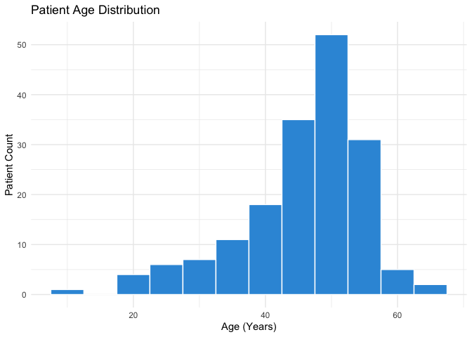
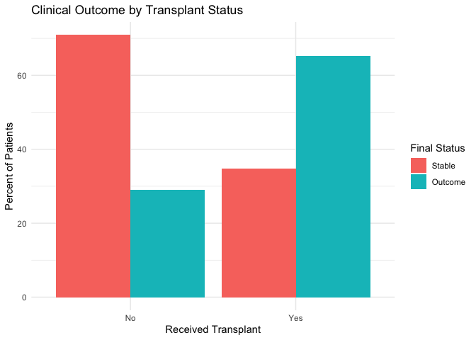

Patient Outcome Analysis: Heart Disease Factors
================

## Executive Summary

This project analyzes the full heart transplant wait-list data set (172
patients) from the Machine Learning Repository. We explore clinical
indicators such as age and monitoring duration to understand patient
outcomes, demonstrating a data-driven approach to Healthcare IT.

``` r
# Load necessary libraries 
library(tidyverse)
```

    ## ── Attaching core tidyverse packages ──────────────────────── tidyverse 2.0.0 ──
    ## ✔ dplyr     1.2.1     ✔ readr     2.2.0
    ## ✔ forcats   1.0.1     ✔ stringr   1.6.0
    ## ✔ ggplot2   4.0.3     ✔ tibble    3.3.1
    ## ✔ lubridate 1.9.5     ✔ tidyr     1.3.2
    ## ✔ purrr     1.2.2     
    ## ── Conflicts ────────────────────────────────────────── tidyverse_conflicts() ──
    ## ✖ dplyr::filter() masks stats::filter()
    ## ✖ dplyr::lag()    masks stats::lag()
    ## ℹ Use the conflicted package (<http://conflicted.r-lib.org/>) to force all conflicts to become errors

``` r
library(ggplot2)

# Contains professional "Heart" data set
data(heart, package = "survival")

# Data cleaning
heart_clean <- heart %>%
  mutate(Age = round(age + 48), # correcting to actual age
    Status = factor(event, levels = c(0, 1), labels = c("Stable", "Outcome")), # labeling clinical outcomes
    Monitoring_Days = as.integer(stop - start),  # calculating total observation period
    Transplant = factor(transplant, levels = c(0, 1), labels = c("No", "Yes"))) %>% # labeling transplant status
  select(Age, Status, Monitoring_Days, Transplant)
heart_clean
```

    ##     Age  Status Monitoring_Days Transplant
    ## 1    31 Outcome              50         No
    ## 2    52 Outcome               6         No
    ## 3    54  Stable               1         No
    ## 4    54 Outcome              15        Yes
    ## 5    40  Stable              36         No
    ## 6    40 Outcome               3        Yes
    ## 7    21 Outcome              18         No
    ## 8    55 Outcome               3         No
    ## 9    51  Stable              51         No
    ## 10   51 Outcome             624        Yes
    ## 11   45 Outcome              40         No
    ## 12   47 Outcome              85         No
    ## 13   43  Stable              12         No
    ## 14   43 Outcome              46        Yes
    ## 15   48  Stable              26         No
    ## 16   48 Outcome             127        Yes
    ## 17   53 Outcome               8         No
    ## 18   55  Stable              17         No
    ## 19   55 Outcome              64        Yes
    ## 20   54  Stable              37         No
    ## 21   54 Outcome            1350        Yes
    ## 22   54 Outcome               1         No
    ## 23   49  Stable              28         No
    ## 24   49 Outcome             280        Yes
    ## 25   20 Outcome              36         No
    ## 26   57  Stable              20         No
    ## 27   57 Outcome              23        Yes
    ## 28   59 Outcome              37         No
    ## 29   55  Stable              18         No
    ## 30   55 Outcome              10        Yes
    ## 31   43  Stable               8         No
    ## 32   43 Outcome            1024        Yes
    ## 33   43  Stable              12         No
    ## 34   43 Outcome              39        Yes
    ## 35   58  Stable               3         No
    ## 36   58 Outcome             730        Yes
    ## 37   52  Stable              83         No
    ## 38   52 Outcome             136        Yes
    ## 39   33  Stable              25         No
    ## 40   33  Stable            1775        Yes
    ## 41   31  Stable            1401         No
    ## 42    9 Outcome             263         No
    ## 43   54  Stable              71         No
    ## 44   54 Outcome               1        Yes
    ## 45   50 Outcome              35         No
    ## 46   45  Stable              16         No
    ## 47   45 Outcome             836        Yes
    ## 48   55 Outcome              16         No
    ## 49   64  Stable              17         No
    ## 50   64 Outcome              60        Yes
    ## 51   49  Stable              51         No
    ## 52   49  Stable            1536        Yes
    ## 53   41  Stable              23         No
    ## 54   41  Stable            1549        Yes
    ## 55   43 Outcome              12         No
    ## 56   49  Stable              46         No
    ## 57   49 Outcome              54        Yes
    ## 58   62  Stable              19         No
    ## 59   62 Outcome              47        Yes
    ## 60   41  Stable               4         No
    ## 61   41 Outcome               0        Yes
    ## 62   51  Stable               2         No
    ## 63   51 Outcome              51        Yes
    ## 64   48  Stable              41         No
    ## 65   48  Stable            1367        Yes
    ## 66   45  Stable              58         No
    ## 67   45  Stable            1264        Yes
    ## 68   36 Outcome               3         No
    ## 69   43 Outcome               2         No
    ## 70   43 Outcome              40         No
    ## 71   36  Stable               1         No
    ## 72   36 Outcome              44        Yes
    ## 73   49  Stable               2         No
    ## 74   49 Outcome             994        Yes
    ## 75   47  Stable              21         No
    ## 76   47 Outcome              51        Yes
    ## 77   56 Outcome               9         No
    ## 78   37  Stable              36         No
    ## 79   37  Stable            1106        Yes
    ## 80   46  Stable              83         No
    ## 81   46 Outcome             897        Yes
    ## 82   49  Stable              32         No
    ## 83   49 Outcome             253        Yes
    ## 84   41 Outcome             102         No
    ## 85   47  Stable              41         No
    ## 86   47 Outcome             147        Yes
    ## 87   48 Outcome               3         No
    ## 88   52  Stable              10         No
    ## 89   52 Outcome              51        Yes
    ## 90   39  Stable              67         No
    ## 91   39  Stable             875        Yes
    ## 92   41 Outcome             149         No
    ## 93   48  Stable              21         No
    ## 94   48 Outcome             322        Yes
    ## 95   41  Stable              78         No
    ## 96   41  Stable             838        Yes
    ## 97   49  Stable               3         No
    ## 98   49 Outcome              65        Yes
    ## 99   53 Outcome               2         No
    ## 100  39 Outcome              69         No
    ## 101  33  Stable              27         No
    ## 102  33  Stable             815        Yes
    ## 103  49  Stable              33         No
    ## 104  49 Outcome             551        Yes
    ## 105  51  Stable              12         No
    ## 106  51 Outcome              66        Yes
    ## 107  53 Outcome              32         No
    ## 108  20  Stable              57         No
    ## 109  20 Outcome             228        Yes
    ## 110  45  Stable               3         No
    ## 111  45 Outcome              65        Yes
    ## 112  48  Stable              10         No
    ## 113  48  Stable             660        Yes
    ## 114  53  Stable               5         No
    ## 115  53 Outcome              25        Yes
    ## 116  47  Stable              31         No
    ## 117  47  Stable             589        Yes
    ## 118  27  Stable               4         No
    ## 119  27  Stable             592        Yes
    ## 120  56  Stable              27         No
    ## 121  56 Outcome              63        Yes
    ## 122  29  Stable               5         No
    ## 123  29 Outcome              12        Yes
    ## 124  52 Outcome               2         No
    ## 125  52  Stable              46         No
    ## 126  52  Stable             499        Yes
    ## 127  41 Outcome              21         No
    ## 128  49  Stable             210         No
    ## 129  49  Stable             305        Yes
    ## 130  54  Stable              67         No
    ## 131  54 Outcome              29        Yes
    ## 132  46  Stable              26         No
    ## 133  46  Stable             456        Yes
    ## 134  53  Stable               6         No
    ## 135  53  Stable             439        Yes
    ## 136  29  Stable             428         No
    ## 137  53  Stable              32         No
    ## 138  53 Outcome              48        Yes
    ## 139  43  Stable              37         No
    ## 140  43 Outcome             297        Yes
    ## 141  48 Outcome               5         No
    ## 142  49  Stable               8         No
    ## 143  49  Stable             389        Yes
    ## 144  46  Stable              60         No
    ## 145  46 Outcome              50        Yes
    ## 146  54  Stable              31         No
    ## 147  54  Stable             339        Yes
    ## 148  51  Stable             139         No
    ## 149  51 Outcome              68        Yes
    ## 150  52  Stable             160         No
    ## 151  52 Outcome              26        Yes
    ## 152  48 Outcome             340         No
    ## 153  45  Stable             310         No
    ## 154  45  Stable              30        Yes
    ## 155  48  Stable              28         No
    ## 156  48  Stable             237        Yes
    ## 157  44  Stable               4         No
    ## 158  44 Outcome             161        Yes
    ## 159  40  Stable               2         No
    ## 160  40 Outcome              14        Yes
    ## 161  27  Stable              13         No
    ## 162  27  Stable             167        Yes
    ## 163  24  Stable              21         No
    ## 164  24  Stable             110        Yes
    ## 165  29  Stable              96         No
    ## 166  29  Stable              13        Yes
    ## 167  50 Outcome              21         No
    ## 168  35  Stable              38         No
    ## 169  35  Stable               1        Yes
    ## 170  50  Stable              31         No
    ## 171  40  Stable              11         No
    ## 172  39 Outcome               6         No

``` r
# Verify cleaned data and count
heart_count <- nrow(heart_clean) # counting 172
heart_count
```

    ## [1] 172

## Exploratory Data Analysis

### Age Distribution of Heart Patients

This histogram shows the age range of the 172 patients on the transplant
wait-list. It helps us understand which age group is most affected.

``` r
# creating plot 
ggplot(heart_clean, aes(x = Age)) +
  geom_histogram(binwidth = 5, fill = "#3498db", color = "white") +
  labs(title = "Patient Age Distribution", x = "Age (Years)", y = "Patient Count") +
  theme_minimal()
```

<!-- -->

**Insights:**

- Main Observation: we observed that the heart transplant wait-list is
  not evenly distributed across all ages. The data shows a clear “bell
  shape” that peaks between the ages of 45 and 55.

- Analysis: This suggests that middle-aged patients are the primary
  group requiring heart transplants in this data set. we found an
  interesting thing that there are very few patients under 30 or over
  65, which might mean that heart issues in this group typically arise
  during middle age.

- Application: In health care systems, this information could be used to
  prioritize screening resources for patients entering their 40s.

### Monitoring Duration vs Clinical Status

We analyze if there’s a pattern between how long a patient was monitored
and their final clinical status.

``` r
# creating plot 
ggplot(heart_clean, aes(x = Age, y = Monitoring_Days, color = Status)) +
  geom_point(size = 3, alpha = 0.6) +
  scale_color_manual(values = c("#2ecc71", "#e74c3c")) +
  labs(title = "Age vs. Monitoring Duration",
       x = "Patient Age", y = "Days of Observation",
       color = "Final Status") +
  theme_light()
```

<!-- -->

**Insights:**

- Main Observation: Looking at the scatter plot, we noticed that a lot
  of “Outcomes” (red dots) happen very early—within the first 200 days
  of monitoring.

- Analysis: It seems the first few months are the most critical for any
  age group. Age itself didn’t seem to guarantee a longer or shorter
  monitoring period, but staying stable in the beginning is the key to
  long-term survival.

- Application: This data tells me that hospital systems should trigger
  “high-alert” notifications for new patients during their first 6
  months on the wait-list to improve overall outcomes.
